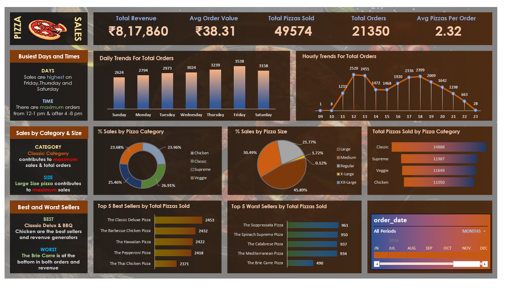

## 📊 Excel Dashboard Preview  

readme_content = """# 🍕 Slice & Analyze: Uncovering Pizza Sales Trends with SQL & Excel

## 📌 Project Overview

This project focuses on analyzing pizza sales data using **SQL for data preprocessing** and **Excel for visualization and dashboard creation**. By leveraging both tools, we efficiently clean, transform, and present key business insights.

## 📊 Key Objectives

- Clean and preprocess raw pizza sales data.
- Calculate essential **KPIs** like total revenue, average order value, and total pizzas sold.
- Generate **interactive Excel dashboards** with charts to visualize sales trends.

## 🛠️ Technologies Used

- **SQL** (Data Cleaning & Aggregation)
- **Excel** (Data Cleaning, Pivot Tables, Charts, Dashboard Creation)

## 📂 Data Processing Steps

### **1️⃣ Data Cleaning in SQL**

- Removed **duplicates** using `ROW_NUMBER()`.
- Standardized text fields with `TRIM()`, `LOWER()`, and `UPPER()`.

### **2️⃣ Data Aggregation & Summarization**

- Used `SUM()`, `COUNT()`, and `AVG()` for KPIs.
- Extracted time-based insights using `DATENAME(WEEKDAY, order_date)` and `DATEPART(HOUR, order_time)`.
- Filtered **last 6 months' sales data** before exporting to Excel.

### **3️⃣ Data Cleaning in Excel**

- Used **Find & Replace** to correct pizza size inconsistencies.
- Applied formulas:
  - `=TEXT([@[order_date]],"dddd")` → Extract weekday name.
  - `=1/COUNTIF(B:B,[@[order_id]])` → Identify unique orders.
- Removed duplicates using **Excel’s Remove Duplicates feature**.

## 📊 KPI Metrics Tracked

1. **Total Revenue**
2. **Average Order Value**
3. **Total Pizzas Sold**
4. **Total Orders**
5. **Average Pizzas Per Order**

## 📈 Charts & Visualizations

- **Daily Trend for Total Orders** (Bar Chart)
- **Hourly Trend for Orders** (Line Chart)
- **Sales Breakdown by Pizza Category** (Pie Chart)
- **Sales Breakdown by Pizza Size** (Pie Chart)
- **Total Pizzas Sold by Category** (Funnel Chart)
- **Top 5 Best-Selling Pizzas** (Bar Chart)
- **Bottom 5 Worst-Selling Pizzas** (Bar Chart)

## 🔥 Why SQL & Excel?

- **SQL:** Handles large datasets efficiently, speeds up queries, and pre-aggregates data before export.
- **Excel:** Provides an interactive and visually appealing dashboard with pivot tables and charts.

## 📌 Conclusion

By combining SQL and Excel, we streamlined the data processing pipeline, ensured **accurate insights**, and built an **efficient dashboard** to help businesses make data-driven decisions. 🚀
"""
